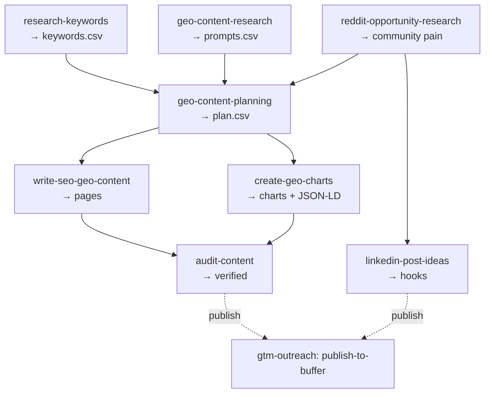

# GTM Content

The **demand + authority layer** of a go-to-market system: content engineered to rank on
Google *and* get cited by answer engines (ChatGPT, Claude, Perplexity, AI Overviews). Each
skill ships a concrete artifact — a keyword cluster, a GEO prompt set, a content
architecture, AI-citable charts, a written page, or LinkedIn hooks grounded in real demand.

Built by [Sneharup Mukherjee](https://github.com/SneharupMukherjee). One of four repos in a
modular GTM stack — see also `gtm-intelligence`, `gtm-outreach`, `gtm-web-analytics`.

---

## Why It Exists

The GTM playbook that won on Google does not win on ChatGPT. Pages need direct answers,
structure, sources, and quotable passages; charts need text layers and structured data;
content plans need to account for prompts and communities, not just keyword volume. These
skills turn that work into repeatable agent workflows.

## What's Inside

```
gtm-content/
├── CLAUDE.md
├── context/
│   └── linkedin-voice.md            ← voice for LinkedIn content
├── skills/
│   ├── capabilities/
│   │   ├── research-keywords/           ← → keywords.csv (schema'd)
│   │   ├── geo-content-research/        ← → prompts.csv (what people ask AI)
│   │   ├── create-geo-charts/           ← AI-readable SVG/HTML + JSON-LD
│   │   └── reddit-opportunity-research/ ← community pain + threads
│   ├── composites/
│   │   ├── geo-content-planning/        ← → plan.csv (content architecture)
│   │   ├── write-seo-geo-content/       ← product-led markdown pages
│   │   ├── audit-content/               ← verify stats, links, claims pre-publish
│   │   └── linkedin-post-ideas/         ← Reddit trends → hooks in-voice
│   └── playbooks/
│       └── geo-content-pipeline/        ← the full research→plan→write→audit engine
├── examples/linkedin-post-idea/     ← a fully worked build (Reddit → LinkedIn hooks)
├── schemas/  scripts/  outputs/  .github/workflows/
```

Each skill carries its own `*.schema.md` for the CSV artifacts it emits, so stages hand off
cleanly.

## The Content Pipeline



## Getting Started

### 1. Clone and open
```bash
git clone https://github.com/SneharupMukherjee/gtm-content.git
cd gtm-content
claude .
```

### 2. Research
```
Read skills/capabilities/research-keywords/SKILL.md and find keywords for [brand.com]
Read skills/capabilities/geo-content-research/SKILL.md and find AI prompts for [category]
```

### 3. Plan → write → audit (or run the whole pipeline)
```
Read skills/playbooks/geo-content-pipeline/SKILL.md and build the content pipeline for [brand.com]
```

## What Not to Commit

- Scraped raw data / `*.csv` outside `examples/`
- API keys — `.env` only, gitignored

## Example

`examples/linkedin-post-idea/` is the fully built-out **LinkedIn hook generator**: it mines
Reddit for real coaching-community pain, ranks by engagement, and drafts hooks in a specific
voice — every idea traceable to a real thread.

## License

MIT
