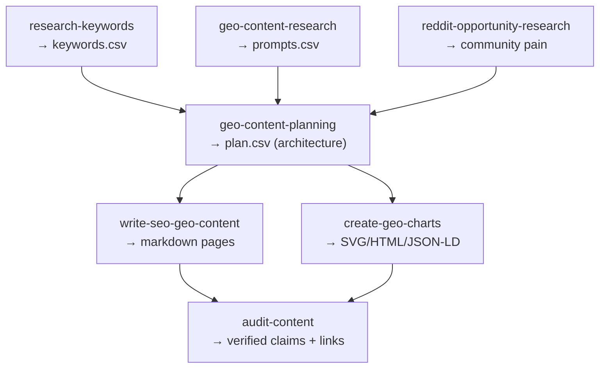

# GEO Content Pipeline

**Tier:** playbook
**Duration:** multi-session
**Output:** `outputs/content/` — keywords.csv, prompts.csv, plan.csv, markdown pages, charts

## Quick Start

```
Read skills/playbooks/geo-content-pipeline/SKILL.md and build the content pipeline for [brand.com]
```

## Purpose

Search is shifting from ranked blue links to answer engines (ChatGPT, Claude, Perplexity,
AI Overviews). Winning there needs direct answers, structure, sources, quotable passages,
and AI-readable charts. This playbook runs the whole chain so each stage's file becomes
context for the next.

## Pipeline



## Process

1. **Research** — `research-keywords` + `geo-content-research` (+ `reddit-opportunity-research`).
2. **Plan** — `geo-content-planning` reads the research and emits `plan.csv` (which pages,
   which clusters, build order).
3. **Produce** — `write-seo-geo-content` for pages, `create-geo-charts` for evidence.
4. **Audit** — `audit-content` verifies every stat, URL, and claim before publishing.
5. **Distribute** — hand finished pieces to gtm-outreach `publish-to-buffer` or the web repo.

## Inputs

- Brand DNA (from gtm-intelligence `brand-research`)
- Target keyword/prompt space

## Chains With

- Uses every capability + composite in this repo
- Upstream: gtm-intelligence `brand-research`
- Downstream: gtm-outreach `publish-to-buffer`, gtm-web-analytics `build-resource-pages`
